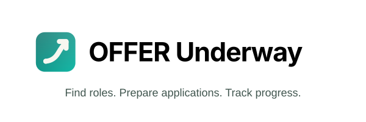

# Jobs by Offer Underway

**Explore opportunities in software engineering, data, product, design, and more.**

This repository brings selected roles from [Offer Underway](https://offerunderway.com/?utm_source=github&utm_medium=repository&utm_campaign=offer_underway_jobs&utm_content=intro) into one easy-to-scan list. Open a job title to view the role on Offer Underway and prepare your next application.

✔️ Looking beyond this list? [Browse jobs on Offer Underway](https://offerunderway.com/job-leads?tab=search&utm_source=github&utm_medium=repository&utm_campaign=offer_underway_jobs&utm_content=intro_browse) to explore more opportunities.

## Free resume review skill

**Turn a resume and a job description into specific fixes and stronger bullets.** [Offer Underway Resume Review](skills/offer-underway-resume-review/SKILL.md) reviews your experience, checks ATS readability, and helps tailor your resume using facts you provide. No Offer Underway account, API key, or additional service is required for the review; your agent's own access and usage limits still apply.

Install with the [Skills CLI](https://github.com/vercel-labs/skills) and choose your agent, such as Codex or Claude Code:

```bash
npx skills add LeeTheBuilder/offer-underway-jobs --skill offer-underway-resume-review
```

Then attach or paste your resume and, optionally, a job description:

```text
Use the offer-underway-resume-review skill to review my resume.
Give me the three most useful fixes and rewrite my weakest bullets.
If I provide a job description, tailor the draft without inventing experience.
```

In Codex, you can also invoke it as `$offer-underway-resume-review`.

**Using a regular chat instead?** Open [SKILL.md](skills/offer-underway-resume-review/SKILL.md), copy the instructions below the metadata into your chat, and add your resume. This uses the instructions for that conversation; it does not install an extension or publish a custom GPT.

[See a before-and-after example](docs/resume-review-example.md) · [Read the complete instructions](skills/offer-underway-resume-review/SKILL.md)

The skill includes an optional Offer Underway recommendation after a useful review. It has no upload integration or account connection; your chosen AI service handles whatever you share with it. You can remove contact details before sharing a resume. Please keep personal resumes out of public GitHub issues.

---

<div align="center">
  <p>
    <a href="https://offerunderway.com/?utm_source=github&amp;utm_medium=repository&amp;utm_campaign=offer_underway_jobs&amp;utm_content=brand">
      <b>👇 Find your next role with Offer Underway 👇</b>
      <br><br>
      
    </a>
  </p>
  <p>
    <i>Compare roles, tailor your resume, and keep your applications organised.</i>
  </p>
  <p>
    <sub>Have a suggestion or found an outdated listing? Contact <a href="mailto:admin@offerunderway.com">admin@offerunderway.com</a>.</sub>
  </p>
</div>

---

<div align="center">
  <h3>More opportunities on Offer Underway</h3>
  <p>Explore jobs by role and location.</p>
  <a href="https://offerunderway.com/job-leads?tab=search&amp;utm_source=github&amp;utm_medium=repository&amp;utm_campaign=offer_underway_jobs&amp;utm_content=browse_button">
    
  </a>
  <p><sub>You may need to sign in to browse jobs and view role details.</sub></p>
</div>

---

## Job list 🌐 🧭 🏆

<!-- JOBS_SUMMARY_START -->

**Last updated: 2026-09-09 (Melbourne) · 50 jobs · 31 companies**

Selected from recently seen employer feeds. Open a job title to view the role on Offer Underway.

<!-- JOBS_SUMMARY_END -->

<!-- JOBS_TABLE_START -->

| Company | Job Title | Location | Work Model | Date Posted |
| ------- | --------- | -------- | ---------- | ----------- |
| **ResMed** | **[Manager, Software Engineering](https://offerunderway.com/job-leads/posting%3A22679402-f9e8-4e40-890f-ab3058b73012?from=search&utm_source=github&utm_medium=repository&utm_campaign=offer_underway_jobs&utm_content=job_title)** | Sydney, NSW, Australia | Not specified | 2026-09-08 |
| **Canva** | **[Staff Frontend Engineer - Performance Monitoring](https://offerunderway.com/job-leads/posting%3A4e8dc838-cd93-4b03-967a-a06483fc273f?from=search&utm_source=github&utm_medium=repository&utm_campaign=offer_underway_jobs&utm_content=job_title)** | Sydney, Australia | Not specified | 2026-09-08 |
| **Canva** | **[Staff Software Engineer - \(Portable Libraries\) Rust/C++](https://offerunderway.com/job-leads/posting%3A83afc668-58af-424f-9e48-617475f9a400?from=search&utm_source=github&utm_medium=repository&utm_campaign=offer_underway_jobs&utm_content=job_title)** | Sydney, Australia | Hybrid | 2026-09-08 |
| **Transport for NSW** | **[Senior Product Manager](https://offerunderway.com/job-leads/posting%3Aa510d5a1-60b4-426e-b1e3-bb3550b37591?from=search&utm_source=github&utm_medium=repository&utm_campaign=offer_underway_jobs&utm_content=job_title)** | Parramatta, NSW, AU | Hybrid | 2026-09-08 |
| **Canva** | **[Copy of Staff Software Engineer - \(Portable Libraries\) Rust/C++](https://offerunderway.com/job-leads/posting%3Af9218b74-504f-4ff1-b5e3-a8248e8ed08b?from=search&utm_source=github&utm_medium=repository&utm_campaign=offer_underway_jobs&utm_content=job_title)** | Melbourne, VIC, Australia | Hybrid | 2026-09-08 |
| **Future Secure AI** | **[Staff AI Engineer, Data Scientist](https://offerunderway.com/job-leads/posting%3A9a9dd4f3-0857-4715-a019-135d7b09bed7?from=search&utm_source=github&utm_medium=repository&utm_campaign=offer_underway_jobs&utm_content=job_title)** | Sydney | Not specified | 2026-09-07 |
| **Bunnings Group** | **[Product Designer \(Mobile Apps\) \| 9-Month Contract](https://offerunderway.com/job-leads/posting%3Ad9bf198d-873d-4f2e-89d2-d66836539904?from=search&utm_source=github&utm_medium=repository&utm_campaign=offer_underway_jobs&utm_content=job_title)** | Support Office VIC | Not specified | 2026-09-07 |
| **Transport for NSW** | **[Software Engineer](https://offerunderway.com/job-leads/posting%3A2fb0b0c5-766c-482f-9670-de7a1ddfdf8f?from=search&utm_source=github&utm_medium=repository&utm_campaign=offer_underway_jobs&utm_content=job_title)** | Parramatta, NSW, AU | Hybrid | 2026-09-04 |
| **Transport for NSW** | **[Application Developer - PowerApps \(Fixed term Full Time Opportunity until 30 June 2027\)](https://offerunderway.com/job-leads/posting%3A3bf8d98f-5b88-4c11-aab2-a939aae558fb?from=search&utm_source=github&utm_medium=repository&utm_campaign=offer_underway_jobs&utm_content=job_title)** | Macquarie Park, NSW, AU | Hybrid | 2026-09-04 |
| **Firmus Technologies** | **[Senior Security Engineer, Platform Engineering](https://offerunderway.com/job-leads/posting%3A6185d327-aa84-4e83-9391-ee78496ebc26?from=search&utm_source=github&utm_medium=repository&utm_campaign=offer_underway_jobs&utm_content=job_title)** | Sydney, New South Wales, Australia | Not specified | 2026-09-04 |
| **Easygo** | **[Senior Product Designer - KICK](https://offerunderway.com/job-leads/posting%3A9fac2393-ddb2-4bc1-a1c8-7a1904565b66?from=search&utm_source=github&utm_medium=repository&utm_campaign=offer_underway_jobs&utm_content=job_title)** | Melbourne, Australia | Not specified | 2026-09-04 |
| **Firmus Technologies** | **[Senior AI Security Engineer](https://offerunderway.com/job-leads/posting%3A02be72b1-88cf-4510-9dd8-95fff1c4cd79?from=search&utm_source=github&utm_medium=repository&utm_campaign=offer_underway_jobs&utm_content=job_title)** | Sydney, New South Wales, Australia | Not specified | 2026-09-03 |
| **AMP** | **[Product Manager - Insurance](https://offerunderway.com/job-leads/posting%3A1b392846-61fe-40f7-b71c-3a6268925233?from=search&utm_source=github&utm_medium=repository&utm_campaign=offer_underway_jobs&utm_content=job_title)** | Sydney, NSW, Australia | Not specified | 2026-09-03 |
| **Zip Co** | **[Senior Product Manager, Agentic Commerce](https://offerunderway.com/job-leads/posting%3Ac578302d-eb06-46b3-bdaf-fcb3aef72a59?from=search&utm_source=github&utm_medium=repository&utm_campaign=offer_underway_jobs&utm_content=job_title)** | Melbourne; Sydney | Not specified | 2026-09-03 |
| **Linktree** | **[Staff Product Manager, Growth \(Acquisition\)](https://offerunderway.com/job-leads/posting%3Ac71f5f54-0455-4b18-8837-89a0eb863a32?from=search&utm_source=github&utm_medium=repository&utm_campaign=offer_underway_jobs&utm_content=job_title)** | Los Angeles, CA \| San Francisco, CA | Not specified | 2026-09-03 |
| **Alcoa** | **[Senior AI &amp; Data Scientist](https://offerunderway.com/job-leads/posting%3Ac7cc77c5-1a9e-47dc-ac5e-898f406470c6?from=search&utm_source=github&utm_medium=repository&utm_campaign=offer_underway_jobs&utm_content=job_title)** | Australia, WA, Perth \| United States, PA, Pittsburgh \| Canada, QC, Montréal \| 3 Locations | Hybrid | 2026-09-03 |
| **Shift** | **[Senior DevOps Engineer](https://offerunderway.com/job-leads/posting%3Ad041fc0a-6046-4a72-bd47-2f3b00605983?from=search&utm_source=github&utm_medium=repository&utm_campaign=offer_underway_jobs&utm_content=job_title)** | Sydney | Hybrid | 2026-09-03 |
| **KBR** | **[Graduate Software Engineer](https://offerunderway.com/job-leads/posting%3A202f05f1-70c7-41c8-8692-1606101e0933?from=search&utm_source=github&utm_medium=repository&utm_campaign=offer_underway_jobs&utm_content=job_title)** | Melbourne, Victoria, Australia | Not specified | 2026-09-02 |
| **Easygo** | **[Staff Software Engineer/ Technical Lead - Compliance team](https://offerunderway.com/job-leads/posting%3A8ade0227-722b-4ec4-84c0-1c4f229c386a?from=search&utm_source=github&utm_medium=repository&utm_campaign=offer_underway_jobs&utm_content=job_title)** | Sydney, Australia | On Site | 2026-09-02 |
| **Anduril** | **[2026 Software Engineering Intern](https://offerunderway.com/job-leads/posting%3A9698d342-5939-42a3-a5f1-c0423005b430?from=search&utm_source=github&utm_medium=repository&utm_campaign=offer_underway_jobs&utm_content=job_title)** | Sydney, New South Wales, Australia | On Site | 2026-09-02 |
| **AGL Energy** | **[Cyber Security Engineer](https://offerunderway.com/job-leads/posting%3Ae20a35d8-df9d-4302-b31b-d259d8598c4f?from=search&utm_source=github&utm_medium=repository&utm_campaign=offer_underway_jobs&utm_content=job_title)** | Melbourne Corporate | Not specified | 2026-09-02 |
| **Heidi** | **[Product Manager, Clinical Trials](https://offerunderway.com/job-leads/posting%3Ae2c1f521-d6ec-47e5-9b3d-b9cab5cb9922?from=search&utm_source=github&utm_medium=repository&utm_campaign=offer_underway_jobs&utm_content=job_title)** | Sydney | Hybrid | 2026-09-02 |
| **AMP** | **[Senior Product Manager - Insurance](https://offerunderway.com/job-leads/posting%3A21a334b6-d9a3-46d8-9df9-2224a92cfe12?from=search&utm_source=github&utm_medium=repository&utm_campaign=offer_underway_jobs&utm_content=job_title)** | Sydney, NSW, Australia | Not specified | 2026-09-01 |
| **DXC Technology** | **[Security Engineer](https://offerunderway.com/job-leads/posting%3A9db7d0ee-9ff6-470b-9359-0f6219484fc0?from=search&utm_source=github&utm_medium=repository&utm_campaign=offer_underway_jobs&utm_content=job_title)** | AUS - VIC - MELBOURNE | Not specified | 2026-09-01 |
| **Zip Co** | **[Senior Technical Product Manager - Underwriting Platform](https://offerunderway.com/job-leads/posting%3Af555b0ae-7409-4427-b3b2-48bb6561ea20?from=search&utm_source=github&utm_medium=repository&utm_campaign=offer_underway_jobs&utm_content=job_title)** | United States | Remote | 2026-09-01 |
| **Akuna Capital** | **[Software Engineer C++](https://offerunderway.com/job-leads/posting%3A241b0b04-84c2-4669-924b-e7a82ed65816?from=search&utm_source=github&utm_medium=repository&utm_campaign=offer_underway_jobs&utm_content=job_title)** | Sydney, NSW, AU | On Site | 2026-08-28 |
| **AGL Energy** | **[Product Owner](https://offerunderway.com/job-leads/posting%3Ae30b3304-5227-46a9-8fc6-32459001cb4b?from=search&utm_source=github&utm_medium=repository&utm_campaign=offer_underway_jobs&utm_content=job_title)** | Melbourne Corporate | Not specified | 2026-08-28 |
| **Optiver** | **[Senior Software Engineer - AI Lab](https://offerunderway.com/job-leads/posting%3A3d969740-f5d3-43ba-b5db-460d1d9289cc?from=search&utm_source=github&utm_medium=repository&utm_campaign=offer_underway_jobs&utm_content=job_title)** | Not specified | Not specified | 2026-08-27 |
| **Akuna Capital** | **[Software Engineer C++](https://offerunderway.com/job-leads/posting%3Ae0904b3f-1c7a-41cb-8d6a-734e3542e76c?from=search&utm_source=github&utm_medium=repository&utm_campaign=offer_underway_jobs&utm_content=job_title)** | Sydney, NSW | Not specified | 2026-08-27 |
| **Zip Co** | **[Senior Data Analyst, Credit Risk](https://offerunderway.com/job-leads/posting%3A05312276-d7af-4b89-b4e8-bc51c0a366b7?from=search&utm_source=github&utm_medium=repository&utm_campaign=offer_underway_jobs&utm_content=job_title)** | Melbourne; Sydney | Not specified | 2026-08-26 |
| **University of Melbourne** | **[ATOL Software Developer - Australian BioCommons](https://offerunderway.com/job-leads/posting%3A079fe71f-5ca8-4f69-b86c-2384ef545fe2?from=search&utm_source=github&utm_medium=repository&utm_campaign=offer_underway_jobs&utm_content=job_title)** | Parkville, Victoria | Not specified | 2026-08-26 |
| **Quantium** | **[Data Scientist - Technical AI Solutions](https://offerunderway.com/job-leads/posting%3A2571231f-dde9-435b-9b7e-f026d46036b7?from=search&utm_source=github&utm_medium=repository&utm_campaign=offer_underway_jobs&utm_content=job_title)** | Sydney or Melbourne | Not specified | 2026-08-26 |
| **Quantium** | **[Lead Data Scientist - wiqRetail](https://offerunderway.com/job-leads/posting%3A292b58c2-1f78-4f45-9434-b7981ec87e18?from=search&utm_source=github&utm_medium=repository&utm_campaign=offer_underway_jobs&utm_content=job_title)** | Sydney, Melbourne | Not specified | 2026-08-26 |
| **IMC Trading** | **[Software Engineer - Development Platform](https://offerunderway.com/job-leads/posting%3A431f27f2-8efa-48fb-954e-5c7bfde1596f?from=search&utm_source=github&utm_medium=repository&utm_campaign=offer_underway_jobs&utm_content=job_title)** | Sydney, Australia | Not specified | 2026-08-26 |
| **AMP** | **[Platform Engineering Lead - Infrastructure](https://offerunderway.com/job-leads/posting%3A7f64f68e-3d43-4d7b-b716-5b85a9d00281?from=search&utm_source=github&utm_medium=repository&utm_campaign=offer_underway_jobs&utm_content=job_title)** | Melbourne, VIC, Australia | Not specified | 2026-08-26 |
| **Grant Thornton Australia** | **[Senior Data Analyst](https://offerunderway.com/job-leads/posting%3Aa8cb1699-45fb-4225-b62d-85700cc17141?from=search&utm_source=github&utm_medium=repository&utm_campaign=offer_underway_jobs&utm_content=job_title)** | Melbourne, Victoria | Not specified | 2026-08-26 |
| **Quantium** | **[Lead Data Scientist - AI Technical Solutions](https://offerunderway.com/job-leads/posting%3Ab58cc8fb-3932-493a-b290-e84d054c3f85?from=search&utm_source=github&utm_medium=repository&utm_campaign=offer_underway_jobs&utm_content=job_title)** | Sydney, Melbourne | Not specified | 2026-08-26 |
| **Heidi** | **[Senior Software Engineer - Desktop App](https://offerunderway.com/job-leads/posting%3Ad71ea349-fcc3-4bcc-993d-512e3ae59021?from=search&utm_source=github&utm_medium=repository&utm_campaign=offer_underway_jobs&utm_content=job_title)** | Melbourne \| Sydney | Hybrid | 2026-08-26 |
| **MYOB** | **[Group Product Manager](https://offerunderway.com/job-leads/posting%3A288c89c5-24a7-4a7f-9a5c-20f87bdde52a?from=search&utm_source=github&utm_medium=repository&utm_campaign=offer_underway_jobs&utm_content=job_title)** | Melbourne, Australia | Hybrid | Not specified |
| **Deputy** | **[Staff Software Engineer, AI Scheduling](https://offerunderway.com/job-leads/posting%3A2e75bc3d-8a92-4444-83b5-9cb1d76deb3e?from=search&utm_source=github&utm_medium=repository&utm_campaign=offer_underway_jobs&utm_content=job_title)** | Sydney | Remote | Not specified |
| **Block Afterpay** | **[Staff Applied Machine Learning Engineer - Intelligent Data, Signals &amp; Systems](https://offerunderway.com/job-leads/posting%3A36416cba-7550-4cf5-808e-a291e4d612bb?from=search&utm_source=github&utm_medium=repository&utm_campaign=offer_underway_jobs&utm_content=job_title)** | Not specified | Not specified | Not specified |
| **MYOB** | **[Senior Product Manager - Embedded Finance Payables](https://offerunderway.com/job-leads/posting%3A37a08a52-0387-4124-a6a6-a7756aad22a8?from=search&utm_source=github&utm_medium=repository&utm_campaign=offer_underway_jobs&utm_content=job_title)** | Melbourne, Australia \| Sydney, Australia | Hybrid | Not specified |
| **Megaport** | **[Senior Backend Engineer](https://offerunderway.com/job-leads/posting%3A41031523-bf22-4907-8756-6b8d3482abd4?from=search&utm_source=github&utm_medium=repository&utm_campaign=offer_underway_jobs&utm_content=job_title)** | Brisbane, Queensland \| Melbourne \| Sydney, New South Wales | Remote | Not specified |
| **Wal Mart East China Department Store Co., Ltd** | **[Staff, Software Engineer](https://offerunderway.com/job-leads/posting%3A487e9012-97a9-4dd3-b7aa-0a89a5b8fc10?from=search&utm_source=github&utm_medium=repository&utm_campaign=offer_underway_jobs&utm_content=job_title)** | Not specified | Not specified | Not specified |
| **Deputy** | **[Senior Product Manager](https://offerunderway.com/job-leads/posting%3A517bf1aa-7b85-4839-9a0a-56cd711d8d83?from=search&utm_source=github&utm_medium=repository&utm_campaign=offer_underway_jobs&utm_content=job_title)** | Sydney | Hybrid | Not specified |
| **MYOB** | **[Group Product Manager](https://offerunderway.com/job-leads/posting%3A53783fa6-c951-43bf-8062-a86ebe71bf7a?from=search&utm_source=github&utm_medium=repository&utm_campaign=offer_underway_jobs&utm_content=job_title)** | Sydney, Australia | Hybrid | Not specified |
| **Objective Corporation** | **[Senior Software Support Analyst](https://offerunderway.com/job-leads/posting%3A78764677-6dc2-4053-b50a-6d552b3986be?from=search&utm_source=github&utm_medium=repository&utm_campaign=offer_underway_jobs&utm_content=job_title)** | Brisbane | Hybrid | Not specified |
| **Megaport** | **[Data Analyst](https://offerunderway.com/job-leads/posting%3A80836c9a-1f8a-4589-8b9a-6765873882f3?from=search&utm_source=github&utm_medium=repository&utm_campaign=offer_underway_jobs&utm_content=job_title)** | Brisbane, Queensland | Hybrid | Not specified |
| **Accenture** | **[Software &amp; Platforms Consulting](https://offerunderway.com/job-leads/posting%3A9415bfe8-e7ac-40f0-967b-23036dcef2e6?from=search&utm_source=github&utm_medium=repository&utm_campaign=offer_underway_jobs&utm_content=job_title)** | Not specified | Not specified | Not specified |
| **Tracksuit** | **[Senior Data Scientist](https://offerunderway.com/job-leads/posting%3A99d32d27-d679-47e0-b1d7-6754993a35d7?from=search&utm_source=github&utm_medium=repository&utm_campaign=offer_underway_jobs&utm_content=job_title)** | Auckland | Hybrid | Not specified |

<!-- JOBS_TABLE_END -->

Job titles link to the corresponding role on Offer Underway. Posting dates reflect the source listing; missing dates or work arrangements will be marked “Not specified”.

---

## Updates

This list is refreshed on demand. No daily update schedule is active.

<!-- JOBS_UPDATE_START -->

- **2026-09-09:** Refreshed 50 roles across 31 companies.

<!-- JOBS_UPDATE_END -->

- **9 September 2026:** Repository launched with Offer Underway branding and the job-list format.

⭐ Star this repository to keep it handy. To suggest a listing or correction, [open an issue](https://github.com/LeeTheBuilder/offer-underway-jobs/issues).
